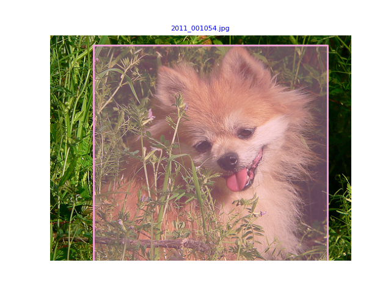

# Code

Code is [here](https://github.com/zhsh9/HKU-DASC7606-A1).

- [x] finish task1-5, ready to train the model with training & validation dataset
- [x] fulfill resnet depth option: 18,34,50,101,152
- [x] set the manual seed of torch: 3407

# definition of logname

```
train_depth50_epochs20_no1           _feb29_1804.log
train,param_list      ,the Nth train ,date
```

# models

## model1

tain on training ds:

```console
$ python train.py --coco_path ./data --output_path ./output --depth 50 --epochs 20 | tee log/train_depth50_epochs20_no1.log
...
[1.5538244498526956, 1.3072959174966718, 1.1412407652892935, 1.0472031251241372, 0.9675452931248766, 0.8907449831526111, 0.8338661640735827, 0.7637128479720101, 0.7038242877057688, 0.6509080720317411, 0.6150699346582955, 0
.562676263269125, 0.5294120622373472, 0.49734498825158896, 0.462800533936073, 0.43352010441342675, 0.40314561761475687, 0.3795664301362094, 0.3545866460304737, 0.32529307411998276]
```

evaluate on validation ds:

```console
$ python test.py --coco_path ./data --checkpoint_path ./output/model_final.pt --depth 50 --set_name 'val' | tee log/valid_depth50_epochs20_no1.log
 Average Precision  (AP) @[ IoU=0.50:0.95 | area=   all | maxDets=100 ] = 0.224
 Average Precision  (AP) @[ IoU=0.50      | area=   all | maxDets=100 ] = 0.413
 Average Precision  (AP) @[ IoU=0.75      | area=   all | maxDets=100 ] = 0.223
 Average Precision  (AP) @[ IoU=0.50:0.95 | area= small | maxDets=100 ] = 0.005
 Average Precision  (AP) @[ IoU=0.50:0.95 | area=medium | maxDets=100 ] = 0.064
 Average Precision  (AP) @[ IoU=0.50:0.95 | area= large | maxDets=100 ] = 0.290
 Average Recall     (AR) @[ IoU=0.50:0.95 | area=   all | maxDets=  1 ] = 0.300
 Average Recall     (AR) @[ IoU=0.50:0.95 | area=   all | maxDets= 10 ] = 0.397
 Average Recall     (AR) @[ IoU=0.50:0.95 | area=   all | maxDets=100 ] = 0.400
 Average Recall     (AR) @[ IoU=0.50:0.95 | area= small | maxDets=100 ] = 0.020
 Average Recall     (AR) @[ IoU=0.50:0.95 | area=medium | maxDets=100 ] = 0.212
 Average Recall     (AR) @[ IoU=0.50:0.95 | area= large | maxDets=100 ] = 0.494
```

visualization:

```bash
python vis.py
```



generate test set predictions on testing ds (Undone for this model):

```bash
python test.py --coco_path ./data --checkpoint_path ./output/model_final.pt --depth 50 --set_name 'test'
python test_submission.py --coco_path ./data # check output format
```

## model2

### training

keep all params same but train it with more epochs: 40 -> try to find the convergence point of model training -> which epochs to set for the furthermore models.

```console
$ python train.py --coco_path ./data --output_path ./output --depth 50 --epochs 40 | tee log/train_depth50_epochs40_no2.log
...
epoch_loss_list:
[1.5916821927888187, 1.3292744846383886, 1.1823020935879918, 1.0957840012577105, 1.01449471257451, 0.9309584555898126, 0.8588897227126313, 0.7991556330459324, 0.7447545866327961, 0.6923033849402206, 0.6518430723625375, 0.6
04410376561087, 0.56528558134006, 0.5191527205688042, 0.4878989535816542, 0.4592239510370638, 0.4343891706588993, 0.4030075690371725, 0.37277944700235105, 0.35764804361828084, 0.3348241330777097, 0.3168013905666358, 0.2976
029793196541, 0.28668593891390315, 0.27693140523977516, 0.2621651426265676, 0.24947327262296629, 0.24383938032767083, 0.23293846984958555, 0.2250983702664183, 0.2157967944728489, 0.21210157690298428, 0.19975327165599355, 0
.19877907846812307, 0.19323293236634276, 0.18541328297326648, 0.17950393673303852, 0.1767823570242929, 0.1731491775497589, 0.16610762147658217]
...
 Average Precision  (AP) @[ IoU=0.50:0.95 | area=   all | maxDets=100 ] = 0.229
 Average Precision  (AP) @[ IoU=0.50      | area=   all | maxDets=100 ] = 0.408
 Average Precision  (AP) @[ IoU=0.75      | area=   all | maxDets=100 ] = 0.223
 Average Precision  (AP) @[ IoU=0.50:0.95 | area= small | maxDets=100 ] = 0.016
 Average Precision  (AP) @[ IoU=0.50:0.95 | area=medium | maxDets=100 ] = 0.089
 Average Precision  (AP) @[ IoU=0.50:0.95 | area= large | maxDets=100 ] = 0.290
 Average Recall     (AR) @[ IoU=0.50:0.95 | area=   all | maxDets=  1 ] = 0.289
 Average Recall     (AR) @[ IoU=0.50:0.95 | area=   all | maxDets= 10 ] = 0.369
 Average Recall     (AR) @[ IoU=0.50:0.95 | area=   all | maxDets=100 ] = 0.371
 Average Recall     (AR) @[ IoU=0.50:0.95 | area= small | maxDets=100 ] = 0.032
 Average Recall     (AR) @[ IoU=0.50:0.95 | area=medium | maxDets=100 ] = 0.180
 Average Recall     (AR) @[ IoU=0.50:0.95 | area= large | maxDets=100 ] = 0.457

$ python test.py --coco_path ./data --checkpoint_path ./output/model_final.pt --depth 50 --set_name 'val' | tee log/valid_depth50_epoch40_no2.log

$ python vis.py
```

### visualization

loss curve:

## Hyper-parameter tuning

| model  | depth | optimizer | learning rate | drop_last | batch size | warm-up, prior | α    | γ    |
| ------ | ----- | --------- | ------------- | --------- | ---------- | -------------- | ---- | ---- |
| model1 | 50    | Adam      | 1e-4          | False     | 2          | 0.01           | 0.25 | 2.0  |
| model2 | 50    | Adam      | 1e-4          | False     | 2          | 0.01           | 0.25 | 2.0  |
| model3 | 18    | Adam      | 1e-4          | False     | 2          | 0.01           | 0.25 | 2.0  |
| model4 | 34    | Adam      | 1e-4          | False     | 2          | 0.01           | 0.25 | 2.0  |
| model5 | 101   | Adam      | 1e-4          | False     | 2          | 0.01           | 0.25 | 2.0  |
|        |       |           |               |           |            |                |      |      |

Param position in code (if alteration is essential):

- `depth`

```console
$ python train.py --depth <depth>
$ python test.py --depth <depth>
```

- `optimizer`, `learning_rate`

```python
# train.py > main > optimizer
optimizer = optim.Adam(retinanet.parameters(), lr=1e-4)
```

- `drop_last`
  - The `drop_last` parameter in this context controls whether the data loader should discard the incomplete batch at the end of the iteration when the size of the dataset is not divisible by the batch size.
  - In practice, the choice of `drop_last` depends on your specific requirements. If you want to ensure that each batch has the same number of data points to maintain consistency in training, you might choose `drop_last=True`. However, if you want to utilize all available data, especially when the dataset is not very large, you might opt for `drop_last=False`. It is important to note, however, that retaining an incomplete batch may lead to inconsistencies in the batch normalization statistics (if batch normalization is used) for the last batch compared to the others, which could have a minor impact on training.
- `batch_size` determines the number of data samples used to compute gradients and update model weights during a training iteration. Specifically, the role of the `batch_size` parameter in this context includes:
  - **Memory Management**: The batch size directly impacts the amount of memory required during the training process. Smaller batches use less memory, allowing models to be trained on systems with limited memory. However, batches that are too small can lead to unstable training or slow convergence.
  - **Computational Efficiency**: By leveraging the parallel processing capabilities of modern hardware (like GPUs or TPUs), larger batches can improve computational efficiency. This is because the hardware can process multiple samples within a batch simultaneously, thus completing gradient calculations and weight updates more quickly.
  - **Gradient Estimation**: The samples in each batch are used to estimate the gradient at that point. Larger batches can provide a more accurate gradient estimate as they incorporate information from more data. However, batches that are too large might reduce the model's ability to generalize during training.
  - **Convergence**: Batch size can affect the convergence properties during model training. Some research suggests that an appropriate batch size can help the model converge more quickly to a better solution.
  - **Regularization Effect**: Smaller batches can sometimes have a regularization effect since each update is noisier, which can help the model avoid getting stuck in local minima.

```python
# train.py > main > sampler
sampler = AspectRatioBasedSampler(dataset_train, batch_size=2, drop_last=False)

# retinanet > dataloader.py > AspectRatioBasedSampler
class AspectRatioBasedSampler(Sampler):
    def __init__(self, data_source, batch_size, drop_last):
        self.batch_size = batch_size
				...

    def __len__(self):
        if self.drop_last:
            return len(self.data_source) // self.batch_size
        else:
            return (len(self.data_source) + self.batch_size - 1) // self.batch_size

    def group_images(self):
        # determine the order of the images
        order = list(range(len(self.data_source)))
        order.sort(key=lambda x: self.data_source.image_aspect_ratio(x))

        # divide into groups, one group = one batch
        return [[order[x % len(order)] for x in range(i, i + self.batch_size)] for i in range(0, len(order), self.batch_size)]
```

- warm-up (`prior`)

```python
# retinanet > model.py > ResNet > model_init
def model_init(self):
  	...
    prior = 0.01
    self.classificationModel.output.weight.data.fill_(0)
    self.classificationModel.output.bias.data.fill_(-math.log((1.0 - prior) / prior))
    ...
```

- `α, γ`

```python
# retinanet > losses.py > FocalLoss > forward
class FocalLoss(nn.Module):
    def forward(self, classifications, regressions, anchors, annotations):
        alpha = 0.25
        gamma = 2.0
        ...
```

## model3,4,5

- model3
  - Based on the loss_list, we are informed that 50 epochs is not enough for network depth 18

```console
$ python train.py --coco_path ./data --output_path ./model3 --depth 18 --epochs 50 | tee log/train_depth18_epochs50_no3.log
 Average Precision  (AP) @[ IoU=0.50:0.95 | area=   all | maxDets=100 ] = 0.304
 Average Precision  (AP) @[ IoU=0.50      | area=   all | maxDets=100 ] = 0.478
 Average Precision  (AP) @[ IoU=0.75      | area=   all | maxDets=100 ] = 0.319
 Average Precision  (AP) @[ IoU=0.50:0.95 | area= small | maxDets=100 ] = 0.035
 Average Precision  (AP) @[ IoU=0.50:0.95 | area=medium | maxDets=100 ] = 0.139
 Average Precision  (AP) @[ IoU=0.50:0.95 | area= large | maxDets=100 ] = 0.382
 Average Recall     (AR) @[ IoU=0.50:0.95 | area=   all | maxDets=  1 ] = 0.352
 Average Recall     (AR) @[ IoU=0.50:0.95 | area=   all | maxDets= 10 ] = 0.425
 Average Recall     (AR) @[ IoU=0.50:0.95 | area=   all | maxDets=100 ] = 0.425
 Average Recall     (AR) @[ IoU=0.50:0.95 | area= small | maxDets=100 ] = 0.057
 Average Recall     (AR) @[ IoU=0.50:0.95 | area=medium | maxDets=100 ] = 0.205
 Average Recall     (AR) @[ IoU=0.50:0.95 | area= large | maxDets=100 ] = 0.522
epoch_loss_list:
[1.4996897089551753, 1.2040403247114242, 1.0653194290563817, 0.9758257034902028, 0.8809408868743679, 0.8240104862818802, 0.7586331694555564, 0.6976388244061019, 0.649624379909062, 0.6160755318362178, 0.5736206129897298, 0.541688928717938, 0.4977719859682082, 0.46565801993481754, 0.43757234697824154, 0.41245430582532966, 0.3843969932617986, 0.36113498351485357, 0.34414086817199085, 0.3250861821960159, 0.31000295087079127, 0.2989282929081851, 0.28059000799828393, 0.26884444194706525, 0.2534607782387945, 0.25112210249704287, 0.23778080031290416, 0.229856338058635, 0.22842503081655174, 0.21782112319396413, 0.2100386019836466, 0.2062964416200691, 0.20871497282032364, 0.19068553230329233, 0.1907811889536752, 0.1849663094892423, 0.17380056378988945, 0.17445705697585748, 0.16780385347981533, 0.15981957240132835, 0.1593968208483237, 0.1579678018172235, 0.1518478942063351, 0.15177865247388816, 0.14330497362438266, 0.14385676012909787, 0.13573541866540248, 0.13415937287380963, 0.10076992388303194, 0.08006209629041502]

$ python test.py --coco_path ./data --checkpoint_path ./model3/model_final.pt --depth 18 --set_name 'val' | tee log/valid_depth18_epochs50_no3.log

$ python vis.py
```

```console
$ python train.py --coco_path ./data --output_path ./model3 --depth 18 --epochs 80 | tee log/train_depth18_epochs80_no3.log

$ python test.py --coco_path ./data --checkpoint_path ./model3/model_final.pt --depth 18 --set_name 'val' | tee log/valid_depth18_epochs50_no3.log

$ python vis.py
```

- model4

```console
$ python train.py --coco_path ./data --output_path ./model4 --depth 34 --epochs 50 | tee log/train_depth34_epochs50_no4.log
 Average Precision  (AP) @[ IoU=0.50:0.95 | area=   all | maxDets=100 ] = 0.287
 Average Precision  (AP) @[ IoU=0.50      | area=   all | maxDets=100 ] = 0.455
 Average Precision  (AP) @[ IoU=0.75      | area=   all | maxDets=100 ] = 0.309
 Average Precision  (AP) @[ IoU=0.50:0.95 | area= small | maxDets=100 ] = 0.015
 Average Precision  (AP) @[ IoU=0.50:0.95 | area=medium | maxDets=100 ] = 0.117
 Average Precision  (AP) @[ IoU=0.50:0.95 | area= large | maxDets=100 ] = 0.363
 Average Recall     (AR) @[ IoU=0.50:0.95 | area=   all | maxDets=  1 ] = 0.340
 Average Recall     (AR) @[ IoU=0.50:0.95 | area=   all | maxDets= 10 ] = 0.412
 Average Recall     (AR) @[ IoU=0.50:0.95 | area=   all | maxDets=100 ] = 0.412
 Average Recall     (AR) @[ IoU=0.50:0.95 | area= small | maxDets=100 ] = 0.025
 Average Recall     (AR) @[ IoU=0.50:0.95 | area=medium | maxDets=100 ] = 0.214
 Average Recall     (AR) @[ IoU=0.50:0.95 | area= large | maxDets=100 ] = 0.507
epoch_loss_list:
[1.6027211780388524, 1.3493213718097041, 1.2005559017104426, 1.0817573109832335, 0.9989016679680254, 0.9243821980739673, 0.8597765068604252, 0.806570817283758, 0.7509586330004564, 0.7024351666703468, 0.6507156748603297, 0.6194083641217215, 0.583154296531804, 0.5428892699414938, 0.5085167201001226, 0.4828783282056803, 0.45397009768002616, 0.43339138117244863, 0.4030665038006864, 0.3867030331102295, 0.3644278600819292, 0.34267387191552345, 0.32291754081984614, 0.3062023756746936, 0.29318198249088673, 0.2797942441965153, 0.2705999839882271, 0.25520450626243285, 0.24268527382500762, 0.23772001985871183, 0.2299480134764261, 0.2207381194934073, 0.21444946402082526, 0.2018105147413792, 0.1983299547142723, 0.19787831321050683, 0.19110252841111772, 0.18569881874539956, 0.17913870857368538, 0.17234412436355198, 0.16710634597239826, 0.1669551119021338, 0.1568848570830768, 0.15872284962509678, 0.15080245019314356, 0.14963583615113518, 0.14378988040761478, 0.14532693679899153, 0.1016612858323593, 0.08186726589819167]

$ python test.py --coco_path ./data --checkpoint_path ./model4/model_final.pt --depth 18 --set_name 'val' | tee log/valid_depth34_epochs50_no4.log

$ python vis.py
```

- model5 [x]

```console
$ python train.py --coco_path ./data --output_path ./model5 --depth 101 --epochs 50 | tee log/train_depth101_epochs50_no5.log

$ python test.py --coco_path ./data --checkpoint_path ./model5/model_final.pt --depth 101 --set_name 'val' | tee log/valid_depth101_epochs50_no5.log

$ python vis.py
```

# Manipulate Seed & Learning Rate

**Reference**: [[2109.08203\] Torch.manual_seed(3407) is all you need: On the influence of random seeds in deep learning architectures for computer vision (arxiv.org)](https://arxiv.org/abs/2109.08203)

`torch.manual_seed(3407)` is a function used in PyTorch to set the seed for the random number generator, ensuring the repeatability of experimental results. When you set a fixed seed in your code, the random numbers generated subsequently will be predictable. This means that each time you run the same code, operations involving random number generation will yield the same results. This is very useful for debugging and for comparing the performance of different models, as it removes the variability introduced by randomness.

| model  | seed   | depth | optimizer | learning rate | prior | α    | γ    |
| ------ | ------ | ----- | --------- | ------------- | ----- | ---- | ---- |
| model3 | random | 18    | Adam      | 1e-4          | 0.01  | 0.25 | 2.0  |
| model6 | 3407   | 18    | Adam      | 1e-4          | 0.01  | 0.25 | 2.0  |
| model7 | 3407   | 18    | Adam      | 1e-3          | 0.01  | 0.25 | 2.0  |
| model8 | 3407   | 18    | Adam      | 1e-5          | 0.01  | 0.25 | 2.0  |

Setting the `learning rate` is a crucial decision in machine learning and deep learning as it significantly affects the efficiency and outcome of model training. The learning rate determines the magnitude of model weight updates during each iteration. If the learning rate is too high, it may cause the model to overshoot the optimum point while minimizing the loss function, thus preventing convergence; if the learning rate is too low, model training can be very slow and may get stuck at local minima.

1. Setting the initial learning rate:

   - **Empirical value**: Start with commonly recommended values (for example, 3e-4 is a typical initial learning rate for the Adam optimizer, while SGD often requires higher values, such as 1e-2 or 1e-1).
   - **Learning rate scheduling**: Set a higher initial learning rate and gradually decrease it during training (for instance, using strategies like learning rate decay, step decay, or cosine annealing).

2. Testing and adjusting:

   - **Learning rate range test**: Begin with a small learning rate, gradually increase it, and record the loss values to find the range where the loss decreases most rapidly.
   - **Cross-validation**: Train multiple times using different learning rate values and verify which one performs the best.

## model6

```console
$ python train.py --coco_path ./data --output_path ./model6 --depth 18 --epochs 50 > log/train_depth18_epochs50_no6.log

$ python test.py --coco_path ./data --checkpoint_path ./model6/model_final.pt --depth 18 --set_name 'val' | tee log/valid_depth18_epochs50_no6.log

$ python vis.py
```

## model7

```console
$ python train.py --coco_path ./data --output_path ./model6 --depth 18 --epochs 50 > log/train_depth18_epochs50_no6.log

$ python test.py --coco_path ./data --checkpoint_path ./model6/model_final.pt --depth 18 --set_name 'val' | tee log/valid_depth18_epochs50_no6.log

$ python vis.py
```

## model8

```console
$ python train.py --coco_path ./data --output_path ./model6 --depth 18 --epochs 50 > log/train_depth18_epochs50_no6.log

$ python test.py --coco_path ./data --checkpoint_path ./model6/model_final.pt --depth 18 --set_name 'val' | tee log/valid_depth18_epochs50_no6.log

$ python vis.py
```

